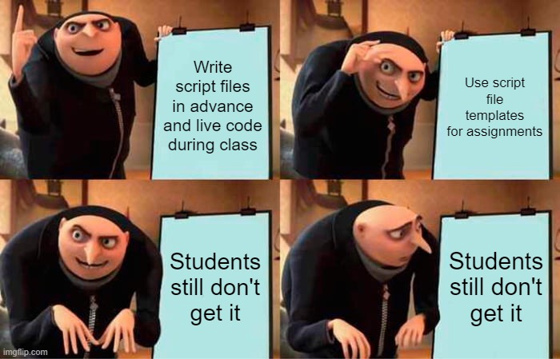
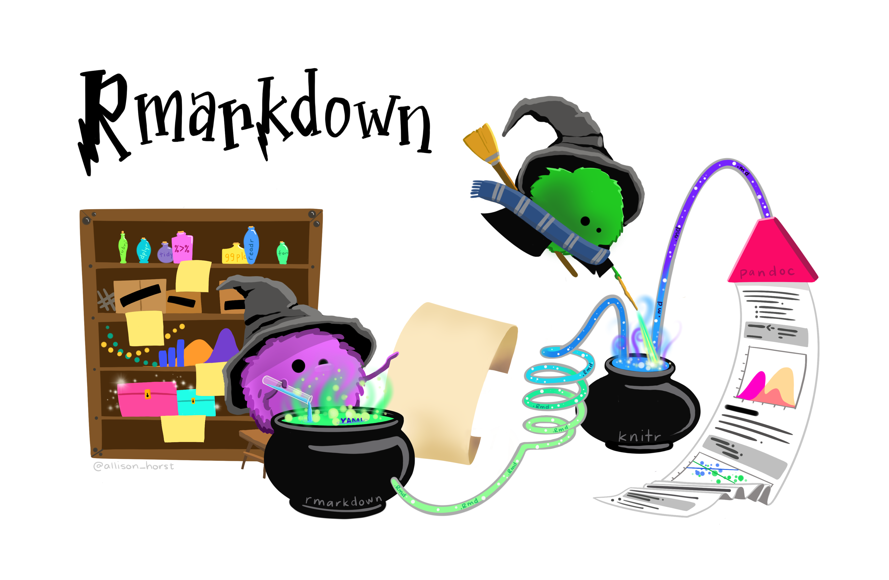

```{r setup, include=FALSE}
options(htmltools.dir.version = FALSE)
```

class: main

# Who Am I?


```{r echo = FALSE, out.width = "40%", out.height="40%"}
knitr::include_graphics("images/profile.jpg")
```

--

- In my tenth year of teaching

--

- Mostly self-taught statistics and writing code

--

- useR since 2016

---
class: main

# Statistics at PLU

- No Statistics Department or Major

--

- Committee of Economics, Math, Psychology, Sociology/Criminal Justice

--

- LOTS of intro courses

---

class: main

## Stat 231: Introductory Statistics


```{r echo = FALSE, out.width = "40%", out.height="40%"}
knitr::include_graphics("images/stat231.png")
```

- "Econ" stats

--

- Required by Business, Nursing, Kinesiology, Data Science*

--

- Wide range of academic standing and ability

---

## Attempt Zero: 
### Fall 2019


```{r echo = FALSE,out.width = "80%", out.height="80%"}

```

---
## Attempt One 
### J-Term 2020

```{r echo = FALSE,out.width = "90%", out.height="90%"}

```

---

## Second Attempt: 
### Fall 2020

```{r echo = FALSE,out.width = "90%", out.height="90%"}

```

.footer[Artwork by @allison_horst]
---

class: main

## Third Times a Charm: 
### Spring 2021

```{r echo = FALSE,out.width = "30%", out.height="30%"}
knitr::include_graphics("images/pkgdown.png")
```

--

- Installed necessary packages as "dependencies"

--

- Lessons saved as vignettes

--

- R Markdown Templates for Assignments

--

- Available at: github.com/npaterno/stat231
---