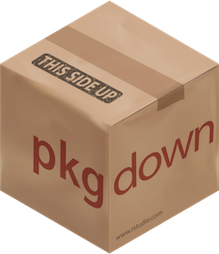

```{r setup, include=FALSE}
options(htmltools.dir.version = FALSE)
```

class: inverse, left, top

## Nick Paterno


  
[`r icons::fontawesome$brands$twitter` @mathl3t3](http://twitter.com/mathl3t3)  
[`r icons::fontawesome$brands$github` @npaterno](http://github.com/npaterno)  
[`r icons::fontawesome$regular$envelope` paternnj@plu.edu](mailto:paternj@plu.edu)

---
class: main

## Statistics at PLU

- No Statistics Department or Major

--

- Committee of Economics, Math, Psychology, Sociology/Criminal Justice

--

- LOTS of intro courses

---

class: main

## Stat 231:
### Introductory Statistics


```{r echo = FALSE, out.width = "40%", out.height="40%", fig.cap="Hexagon Logo for Class"}
knitr::include_graphics("images/stat231.png")
```

- "Econ" stats

--

- Required by Business, Nursing, Kinesiology, Data Science*

--

- Wide range of academic standing and ability

---

## Attempt Zero: 
### Fall 2019


```{r echo = FALSE,out.width = "80%", out.height="80%", fig.cap="Quote: I'm gonna wing it"}

```

---
## Attempt One 
### J-Term 2020

```{r echo = FALSE,out.width = "90%", out.height="90%", fig.cap="Meme of Gru from Dispicable Me"}

```

---

## Second Attempt: 
### Fall 2020

```{r echo = FALSE,out.width = "90%", out.height="90%", fig.cap="RMarkdown Wizards generating reports"}

```

.footer[Artwork by @allison_horst]
---

class: main

## Third Times a Charm: 
### Spring 2021

```{r echo = FALSE,out.width = "30%", out.height="30%", fig.cap="Hexagon logo for Package Down"}

```

--

- Installed necessary packages as "dependencies"

--

- Lessons saved as vignettes

--

- R Markdown Templates for Assignments

--

- Available at: github.com/npaterno/stat231
---
class: inverse


# Thank you!
  
### Find me at...
  
[`r icons::fontawesome$brands$twitter` @mathl3t3](http://twitter.com/mathl3t3)  
[`r icons::fontawesome$brands$github` @npaterno](http://github.com/npaterno)  
[`r icons::fontawesome$regular$envelope` paternnj@plu.edu](mailto:paternj@plu.edu)
---

